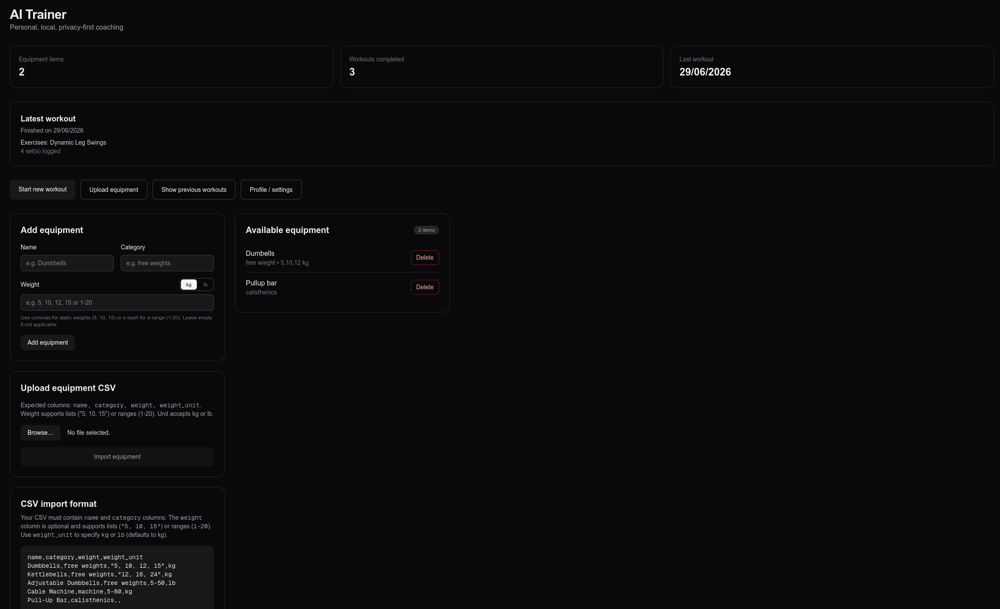

# AI Personal Trainer

A Personal AI Trainer built to run locally first (LM Studio support only for now), to use the hardware people already have, without paying for cloud models. The goal is to fit the model + data into 8 GB of VRAM and produce results quickly enough while still keeping them decent and, most of all, of usable quality.

<p align="center">
  <a href="https://ai-trainer.lunatria.com"><strong>▶ Try the live demo →</strong></a>
</p>

<p align="center">
  
</p>

> **Heads up:** The project is local-first — the app runs entirely on your own machine through LM Studio. The hosted demo above runs the same app against [OpenRouter](https://openrouter.ai/) (a cloud model) instead, so you can try it without installing anything.

> **Status:** First version of creating workouts. Supports timers, profiles and equipment lists.

> **Current Problems:** AI is inconsistent with weight + repetition range, and doesn't take previous workouts into account well enough.


## Why I built this

Honestly I decided to build this because I am a cheapskate and lazy. I don't want to pay someone or something (either with money or my data) for what a local AI model can already do if it's prompted correctly. There are many guides on the internet to generate a "general" workout plan with the help of AI (They are quite good and I am using one currently), but they lack flexibility, and let's be honest, asking AI each time to modify it because of time constraints, bad recovery, is tiring, and why not reduce the friction! As I train at home, having a computer close to me isn't a problem. Hell even if you go to the gym you can connect to the trainer via a VPN (like Tailscale), and leave the computer running during your trip to use it without having a domain or a server.

## Features

- 🏋️ **Equipment-aware** — plans use only the gear you actually own
- 😴 **Recovery-aware** — a quick check-in (sleep, energy, time available) shapes each session
- ⏱️ **Guided sets** — step through the workout one set at a time, with rest timers between them
- 👤 **Profiles & equipment lists** — set up once, reused for every workout
- 🔒 **Local & private** — runs on your own hardware; your data stays in local SQLite

## How it works

Pre-workout check-in gives info about sleep, energy and time available. Profiles and equipment lists are prepared beforehand by the user; the AI receives that information and returns a workout with sets, rest time between sets, and details. The app never replays full conversation history to the model — context is reassembled from the DB on each call to stay within the 8 GB VRAM budget.

## Prerequisites

- **Node.js 20+** (developed against Node 26)
- **[LM-Studio](https://lmstudio.ai/)** installed
- An **LLM model** to load in LM-Studio. This project was tested with `google/gemma-4-e4b`; feel free to use other models, though that may result in different experiences.

## Setup & run

```bash
# 1. Install dependencies
npm install

# 2. Create your local env file (defaults work out of the box)
cp .env.local.example .env.local

# 3. Initialize the database (creates tables + seeds the default user/equipment) 
npm run seed  #if you get sqlite related errors try running "npm rebuild better-sqlite3" and see if that resolve's the issue
```

**4. Start LM-Studio:**

1. Open LM-Studio and download + load a model (e.g. `google/gemma-4-e4b`).
2. Go to the **Developer / Local Server** tab.
3. Start the server on **port `1234`** (this matches `LM_STUDIO_URL` in your env file).

> The LM-Studio server must be running with a model loaded before any AI feature will work.

**5. Start the app:**

```bash
npm run dev
```

Then open **http://localhost:3000**.


## Available scripts

| Command          | Description                                              |
| ---------------- | ------------------------------------------------------- |
| `npm run dev`    | Start the Next.js dev server                            |
| `npm run build`  | Production build                                         |
| `npm run start`  | Run the production build                                |
| `npm run lint`   | Run ESLint                                               |
| `npm run seed`   | Create tables + seed default user/equipment (optional CSV arg) |
| `npm run migrate`| Apply schema migrations                                 |
| `npm run flush`  | Reset / clear database data                             |

## Configuration

`.env.local` holds two variables (defaults shown):

| Variable        | Default                      | Description                                  |
| --------------- | ---------------------------- | -------------------------------------------- |
| `LM_STUDIO_URL` | `http://localhost:1234/v1`   | LM-Studio's OpenAI-compatible endpoint       |
| `DATABASE_PATH` | `./data/ai-trainer.db`       | SQLite database file path (relative to root) |

The `data/` directory is git-ignored, so your database stays local.

## Project layout

- `src/app/api/ai/tools.ts` — server actions: system-prompt building, outline generation, set logging, session close
- `src/lib/llm.ts` — LM-Studio wrapper (Vercel AI SDK pointed at the local endpoint)
- `src/db/` — Drizzle schema (`schema.ts`) and the SQLite client (`client.ts`)
- `scripts/seed.ts` — raw-SQL schema setup + default seed data


## Troubleshooting

- **AI calls fail / hang:** confirm the LM-Studio server is running on port `1234` and a model is loaded.
- **Database errors / missing tables:** run `npm run seed` to create and seed the database.
